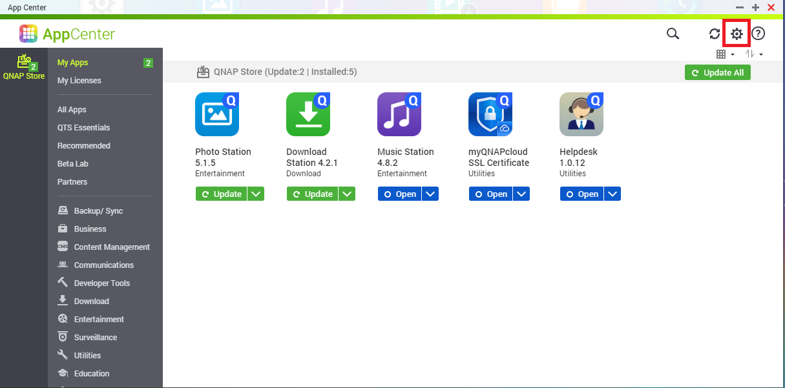
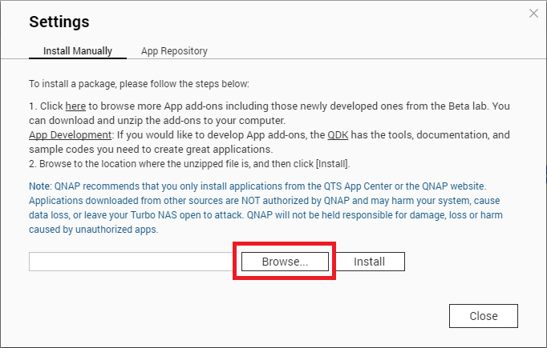

# QNAP Development Kit

## What is QDK

QDK is used to build QPKG files\/applications for QNAP Turbo NAS. 

QDK started out as a simple modification of the first official release of the QPKG SDK, but now supersedes it.

License: GPL

GitHub: [https://github.com/qnap-dev/QDK](https://github.com/qnap-dev/QDK)

## Download QDK:

[https://download.qnap.com/QPKG/QDK/QDK\_2.3.11.zip](https://download.qnap.com/QPKG/QDK/QDK_2.3.11.zip)

## Install “QDK\_X.X.X.qpkg” in NAS UI

